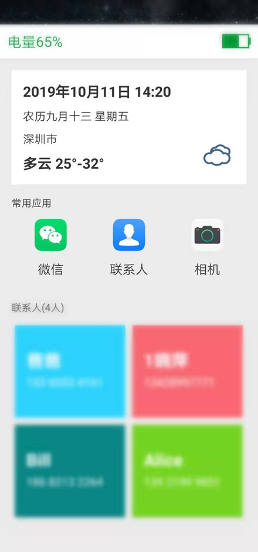
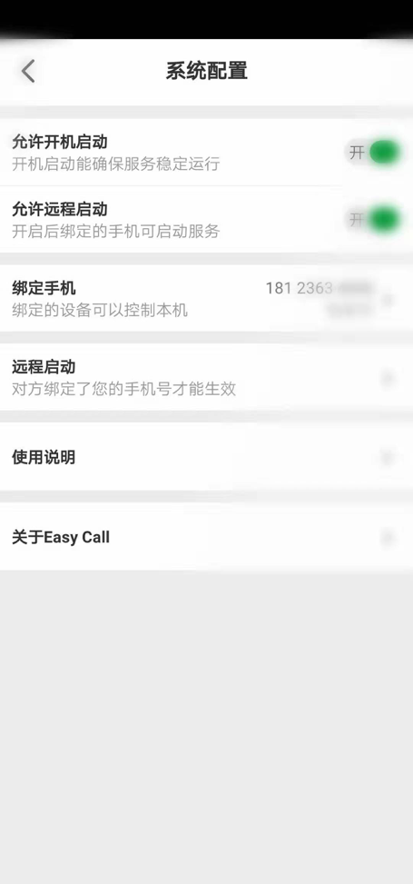

# Easy Call

初衷是给家人做的一款老人锁屏APP，他们不会使用智能手机，不会解锁，不会滑屏，经常打错电话。

所以希望他能按下电源键后就能看到要打电话的人，能知道电池电量，天气，时间日期。

与市面上的老人桌面不同，老人桌面APP的兼容性不好，很多手机不支持，而且对于不会滑屏解锁的老人来说也不会用。

通过锁屏实现的方案没有手机兼容问题，而且只要老人按下电源键，唤醒屏幕即可。

当然，这个方案也有弊端，比如申请权限多，需要可靠的保活机制，需要手机管家开放白名单。

且经过目前的测试，监听屏幕唤醒功能不一定每次都能打开锁屏页面，不过这应该是个技术问题，后续会完善。

## features:

* ### 安装后开启服务就能看到电池电量，日期天气，常用APP，常用联系人

截图：

* ### 锁屏上的日期天气组件可以调整文字图片的大小

截图：

* ### 常用APP的内容可配置，最多可配置6个常用APP，图标和名称大小也可配置

* ### 常用联系人可配置，最多可配置4个常用联系人，联系人名称大小可配置

* ### 可绑定指定手机，绑定后的手机可以远程启动本机服务

截图：

* 绑定后的手机可以远程配置本机的锁屏界面

截图：

## Description

APP是个单页应用，远程控制是通过短信收发实现

APP本身只是个锁屏功能，锁屏功能需要启动后台服务，为了确保锁屏能正常使用，启用了常驻service，只为注册动态广播，监听屏幕的唤醒与熄灭，因为这个广播全局注册是不生效。

APP默认开启了开机启动功能，因为真实场景是老人用到没电关机了，充电后再开机，确保服务开机就能启动，即开机就能正常使用。

APP可以远程启动，万一服务被kill掉了，锁屏无法启动，老人又不会用，绑定者能远程启动服务。

APP下载：

